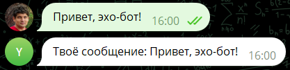

<p align="center">
<a href="https://pypi.org/project/tgbotzero/" target="_blank">

</a>


</p>

# TgBotZero
Телеграм-боты в пару строчек кода.
Простые телеграм-боты должно быть очень просто делать!


## Примеры

Бот, показывающий твоё сообщение:

``` python
import tgbotzero

TOKEN = '123123123:tokenFromBotFatherInTelegram'


def on_message(msg: str):
    return "Твоё сообщение: " + msg
```




# Установаа

Введите в терминале:
```shell
pip install tgbotzero --upgrade --user
```


Или запустите эту программу:

```python
import os, sys
python = sys.executable
user = '--user' if 'venv' not in python and 'envs' not in python else ''
cmd = f'"{python}" -m pip install tgbotzero --upgrade {user}'
os.system(cmd)
```

# [Contributing](CONTRIBUTING.md) 
